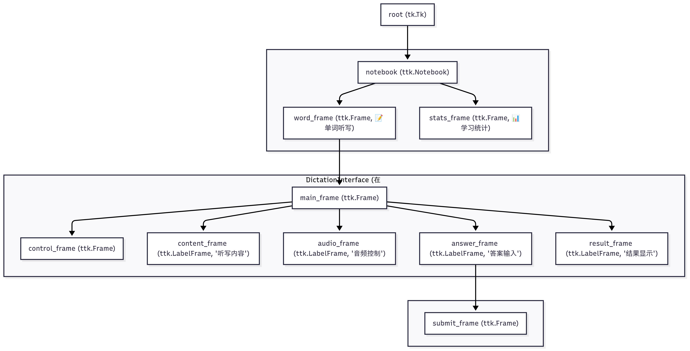

## 文件夹结构
your-project-folder/
├── assets/
│   └── ui-screenshot.png  
│
├── logic/
│   └── core.py
│
├── audio/
│   └── listen.py
│
├── main.py          
└── README.md       
```
```merid
graph TD
    A["root (tk.Tk)"] --> B["notebook (ttk.Notebook)"];

    subgraph " "
        B --> C["word_frame (ttk.Frame, 📝 单词听写)"];
        B --> D["stats_frame (ttk.Frame, 📊 学习统计)"];
    end

    subgraph "DictationInterface (在 word_frame 中创建)"
        C --> E["main_frame (ttk.Frame)"];
        E --> F["control_frame (ttk.Frame)"];
        E --> G["content_frame (ttk.LabelFrame, '听写内容')"];
        E --> H["audio_frame (ttk.LabelFrame, '音频控制')"];
        E --> I["answer_frame (ttk.LabelFrame, '答案输入')"];
        E --> J["result_frame (ttk.LabelFrame, '结果显示')"];
    end

    subgraph " "
        I --> K["submit_frame (ttk.Frame)"];
    end
```
```
```
```
